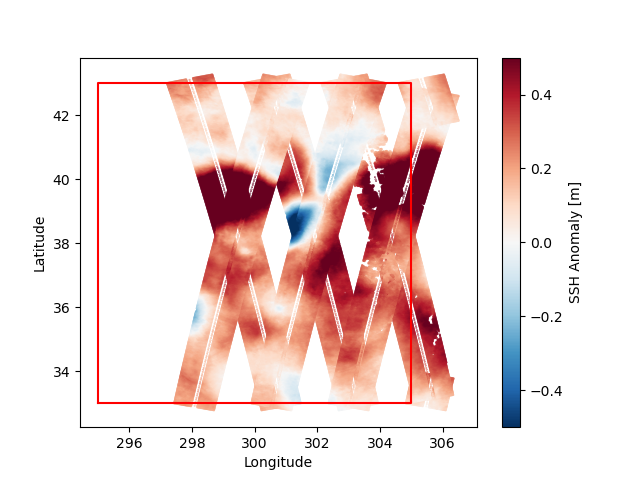

# SwotDB

Efficiently subset and query SWOT data from the source NetCDFs in a scalable way, without duplicating the dataset in a different file format.



---

## How it works

Each SWOT file has along- and across-swath coordinates ordered by time along the swath but which are unstructured in lat-lon. To subset data in a small lat-lon-time bounding box without opening all NetCDF files, we split each file into smaller logical "tiles" (without altering the NetCDF files) and build a `.pkl` index file with coordinate bounding boxes for each tile across the dataset. Building this index is a one-time cost (~1 hr on a single CPU for ~3 years of SWOT data), after which spatiotemporal queries only open the files containing overlapping tiles. Existing indices can be updated as new data become available.

---

## Installation

Install in editable mode for development:

```bash
git clone https://github.com/smartin98/SwotDB.git
cd SwotDB
pip install -e .
```

## Basic usage

Build index:

`swotdb build --data-dir /path/to/swot/data --index-file swot_index_filename`

Update existing index:

`swotdb build --data-dir /path/to/swot/data --index-file swot_index_filename --load-existing`

Use index:

```python
from SwotDB import SWOTSpatialIndex, query_swot_data
import pandas as pd

swot_index_filename = 'swot_index.pkl'
lat_min = 33
lat_max = 43
lon_min = 295
lon_max = 305
time_start = pd.Timestamp('2024-09-21')
time_end = pd.Timestamp('2024-09-28')

index = SWOTSpatialIndex.load(swot_index_filename)

ds = query_swot_data(
    index,
    lat_min, 
    lat_max, 
    lon_min, 
    lon_max,
    time_start=time_start, 
    time_end=time_end,
    variables=['ssha_unfiltered'],
)
```

## Advanced usage

Update the base data path for the index (e.g. if index created on different server to deployment):

`swotdb remap --index-file swot_index_filename --new-base-path /different/path/to/swot/data`

Show index info:

`swotdb info --index-file swot_index_filename --list-files`